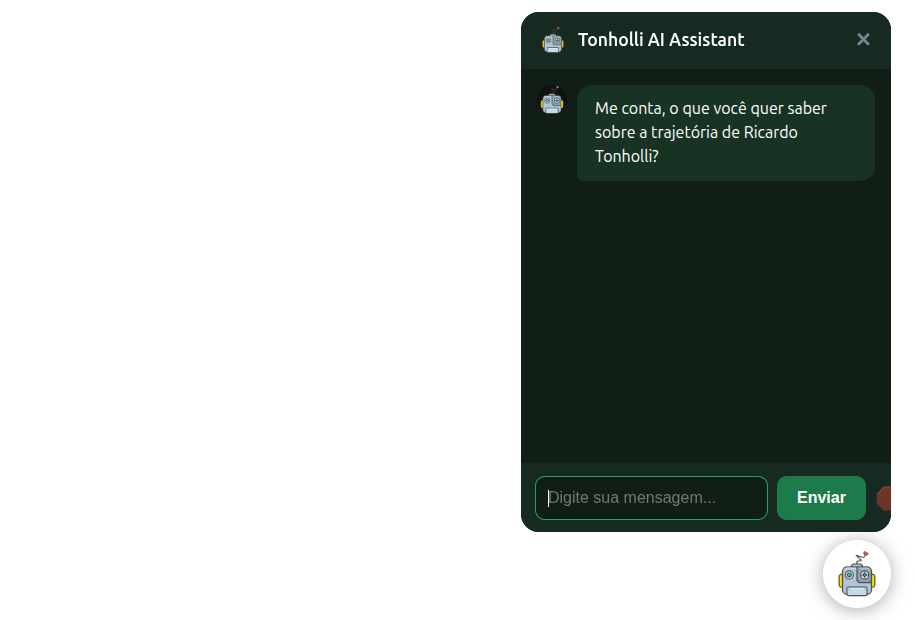

# 🤖 AI Chatbot - Web

Este projeto é um **chatbot de inteligência artificial** que roda diretamente no navegador, utilizando as **novas APIs nativas do Google para LLMs (Modelos de Linguagem de Grande Escala)**.  
O objetivo é fornecer uma experiência de conversação inteligente sem a necessidade de back-end pesado, aproveitando as capacidades modernas da web.

---

## 🚀 Funcionalidades
- Chatbot interativo rodando diretamente no navegador.
- Integração com as novas **APIs nativas do Google AI**.
- Configuração simples via arquivo JSON.
- Organização modular do código:
  - `controllers/` → lógica do chatbot.
  - `services/` → serviços auxiliares (ex: prompts).
  - `views/` → interface e scripts da aplicação.
- Suporte a **prompts customizados** configurados em `systemPrompt.txt`.
- Interface personalizável com **HTML e CSS**.

---

## 🎥 Preview



---

## 🚀 Recursos Principais

- 100% offline (sem chamadas para servidores – ideal para protótipos e privacidade).
- API moderna do Chrome (Prompt API / AI APIs experimentais).
- Arquitetura simples com separação entre Controller, View e Services.
- Suporte a mensagens streaming simuladas / indicador de digitação.
- Fácil de estilizar via CSS custom properties.
- Preparado para abortar requisições (ex: botão Stop nas aulas avançadas)

## ✅ Pré-requisitos

- Node.js 22+ (para scripts utilitários e servidor estático simples).
- Navegador **Chrome** (versão compatível com as AI / Prompt APIs experimentais).
- Habilitar flags experimentais:
    - [chrome://flags/#prompt-api-for-gemini-nano](chrome://flags/#prompt-api-for-gemini-nano)

## 🛠️ Tecnologias Utilizadas
- **JavaScript (ES6+)**
- **APIs Nativas do Google AI**
- **HTML5 & CSS3**
- **Node.js + npm** (para dependências e ambiente de desenvolvimento)

---

## 📦 Instalação e Uso:

1. Clone este repositório:
   ```bash
   git clone https://github.com/RicToni/gemini-api-chrome-ia-assistant

2. Instale ad Dependências:
   ```bash
   npm ci

3. Execute o projeto:
    ```bash
    npm start

## 🔌 Embutindo o Widget em Outro Site

Crie a pasta `botData` no projeto em que queira embutir o widget e customize `botData/chatbot-config.json` para alterar nome, avatar e cores.

Você publicar os arquivos da pasta `sdk/` na Web (um cdn talvez) e referenciar o arquivo, algo como:

```html
<!DOCTYPE html>
<html lang="pt-br">

<head>
    <meta charset="UTF-8">
    <meta name="viewport" content="width=device-width, initial-scale=1.0">
    <title>EW Academy AI Chatbot</title>
    <link rel="icon" type="image/x-icon" href="./botData/avatar.webp">
</head>

<body>
    <script type="module" src="https://erickwendel.github.io/semana-javascript-expert09/aula01-criando-llmstxt/sdk/src/index.js"></script>
</body>

</html>
```
E então o widget aparecerá automaticamente na inicialização na página.

## 🎨 Customização

Conteúdo inicial / comportamento:

- `systemPrompt.txt`: instruções de sistema para o modelo.
- `chatbot-config.json`: metadados (nome, avatar, cores, welcomeBubble etc).

